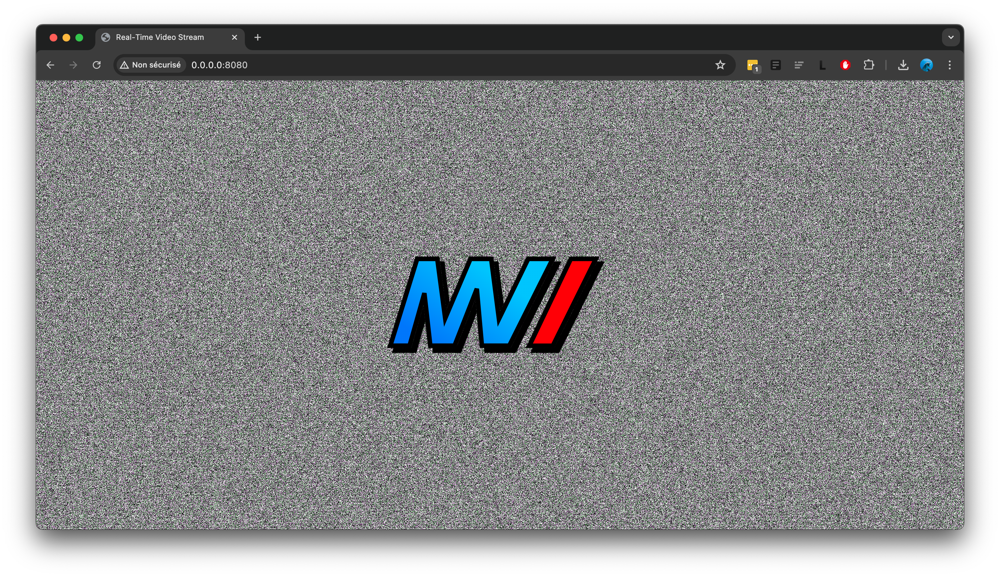
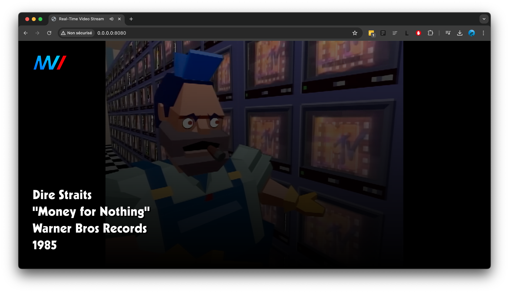

<div align="center">
  <h1>MVTV</h1>
  
  <p align="center" style="max-width: 300px!important">
    A retro-style music video streaming platform, highly inspired by MTV circa 1980s-90s.
  </p>
</div>

### !! Note !! This is still a work in progress and has some issues.  I know.

## How it Should Look

<figure>
  
  <figcaption>
    <small>When you first boot up MVTV, this is the screen you should see.  Press on the logo to start the music.</small>
  </figcaption>
</figure>

<figure>
  
  <figcaption>
    <small>An MVTV music clip in action :-)  You can press anywhere to pause the clip</small>
  </figcaption>
</figure>

## Running The Scripts

### Running the script for the first time
Clone the repo, open a terminal, and navigate to your cloned repo.  Then run these commands:
```
pip install
cd streamer_scripts
python get_music.py
```
This will read the information in urls.json and generate clips.json.  Only after you have generated a clips.json file will you will be able to start the server. You will only have to re-run the above code (without pip install) whenever you add to `urls.json`

### Running the server
From the MVTV folder, open a terminal and run:
```
python app.py
```
Then, in a browser navigate to `0.0.0.0:8080`, and you should see the langing page.

### Adding your own music
The repo includes a selection of music videos, a list of which can be found inside of `streamer_scripts/data/urls.json`.  This file contains the information necessary to know which song to play.  To add to it, just add a record in between the top-level square brackets following the syntax below:
```
{
  "link": [YOUTUBE LINK],
  "artist": [ARTIST/GROUP WHO PERFORMED],
  "title": [TITLE OF THE SONG],
  "year": [RELEASE YEAR OF THE SONG],
  "label": [RECORD LABEL]
},
```
This is all well and dandy, however the script needs a little more information in order to actually include the song in the queue, so you need to rerun the steps detailed in the 'Running the script for the first time' section.